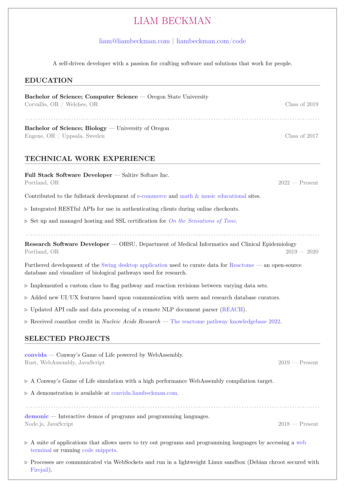

[](https://github.com/lbeckman314/resume/actions)

# About

A simple resume (and coverletter template)!

# Requirements

- [texlive](http://www.tug.org/texlive/): includes the `pdflatex` command for building a PDF from tex files.

# Building

To compile the tex file into a pdf, run:

```sh
make
```

It will output the resume and coverletter as PDFs.


