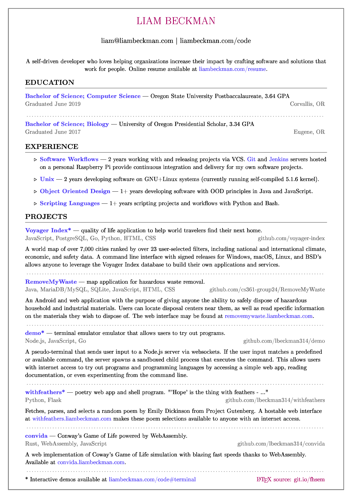
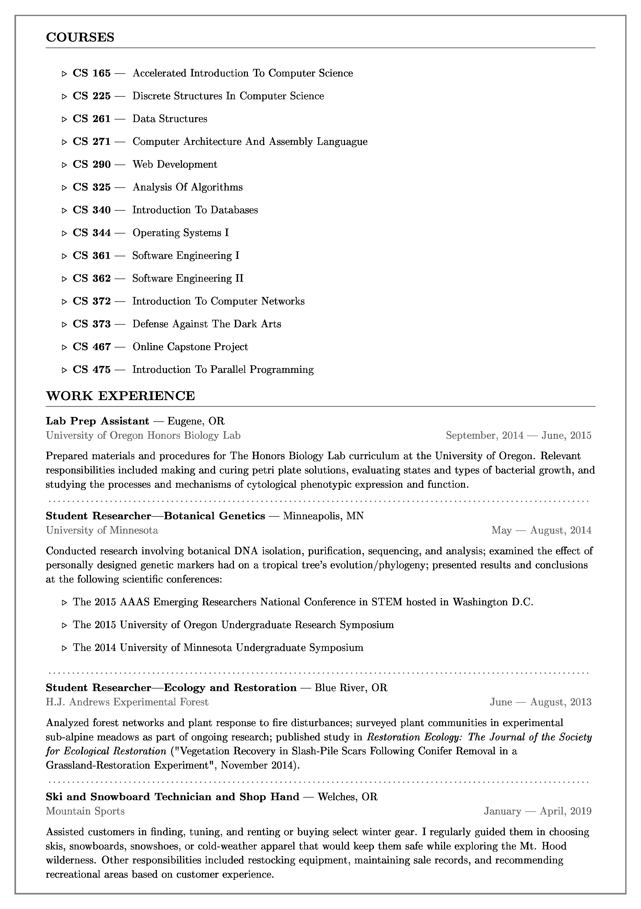
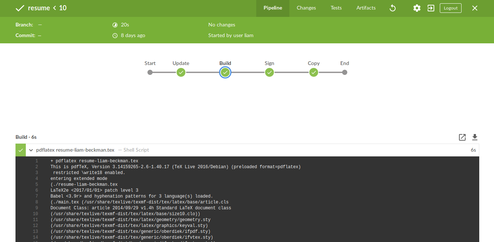

# Requirements

- [texlive](http://www.tug.org/texlive/): includes the `pdflatex` command for building a PDF from tex files.

## Packages 

A shell script ([install.sh](./install.sh)) is available to install the packages below. It uses [tlmgr](https://tug.org/texlive/tlmgr.html) as the package manager in an effort to be OS agnostic.

- easylist
- enumitem
- eso-pic
- geometry
- hyperref
- tikzpagenodes
- titling
- xcolor

# Building

To compile the tex file into a pdf, run:

```sh
pdflatex resume-liam-beckman.tex
```

It will output my resume as a PDF.




Similarly,

```sh
pdflatex coverletter-liam-beckman.tex
```

will output a coverletter example as a PDF.

# CI/CD

The document is built every time a push is made to the `master` branch. Build commands are defined in the [Jenkinsfile](./Jenkinsfile), and build results can be viewed at either of the following URL's.

- [Jenkins (standard)](https://liambeckman.com/jenkins/job/resume/)
- [Jenkins (Blue Ocean)](https://liambeckman.com/jenkins/blue/organizations/jenkins/resume/activity)

[](https://liambeckman.com/jenkins/blue/organizations/jenkins/resume/)
